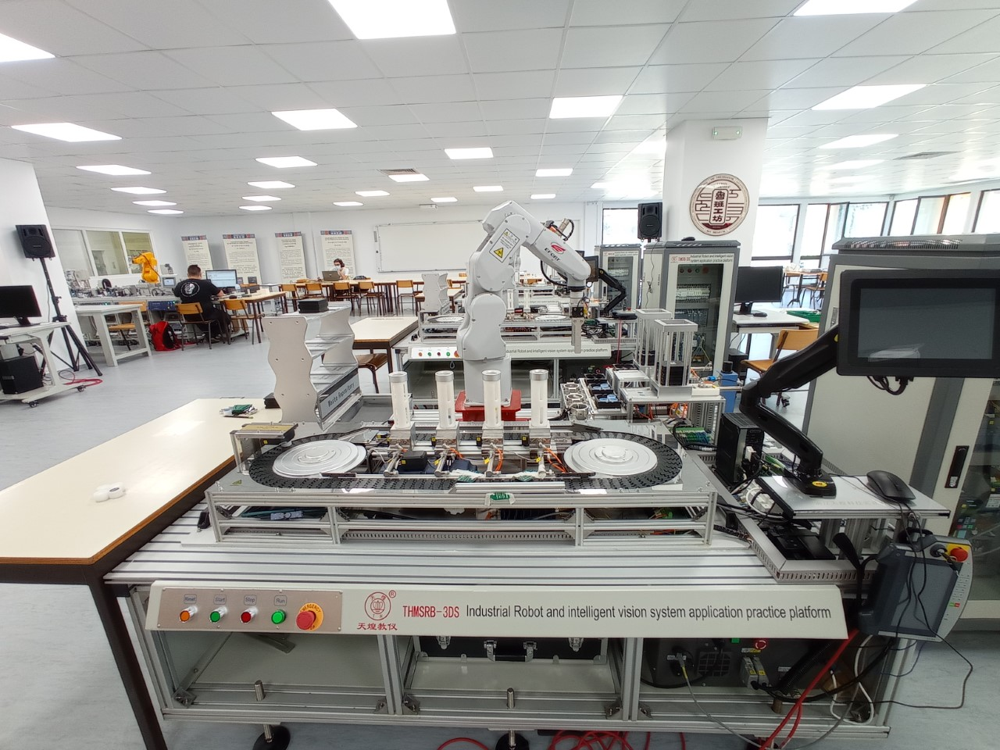

## Apresentação da Lu ban Workshop Portugal

A Oficina Lu Ban Portuguesa, localizada nas instalações da Escola Superior de Tecnologia de Setúbal do Instituto Politécnico de Setúbal, foi Inaugurada no dia 5 de dezembro de 2018 como resultado de uma parceria entre o Instituto Politécnico de Setúbal e a Escola Vocacional de Mecânica e Eletricidade de Tianjin. As Oficinas Lu Ban foram inspiradas num inventor, engenheiro e carpinteiro chinês, Gongshu Ban que viveu na dinastia Zhou. Estas oficinas são plataformas de colaboração tecnológica entre a China e alguns outros países, Índia, Reino Unido, Indonésia, Tailândia, Paquistão e Portugal, sendo a única no nosso pais. 

A Oficina Lu Ban é constituída por 4 processos: 

**SX-815Q** - Linha Farmacêutica, este processo consiste numa estação de alimentação e enchimento de partículas, uma estação de colocação e roscagem de tampas, uma estação de inspeção e classificação de falhas, um robô industrial de manipulação e uma estação de armazenamento inteligente. Permite realizar a montagem inteligente, empacotamento automático, armazenamento tridimensional automatizado e logística inteligente, inspeção e controle automático de qualidade de produção, aquisição de dados para controlo e gestão de processo. Na figura 1, é ilustrado o processo SX-815Q, onde podemos observar a várias estações constituintes do processo.

*SX-815Q - Linha Farmacêutica*

**THMSRB-3** - Linha de Armazenamento e Diferenciação de peças através do RFID, este processo consiste num robô industrial com seis graus de liberdade, um sistema de inspeção visual inteligente, um sistema de transmissão de dados RFID, um sistema de comando por PLC e um conjunto de mecanismo de alimentação, transporte, montagem e armazenamento. O sistema pode realizar funções de deteção, classificação, manuseio, montagem e armazenamento com velocidade de transmissão elevadas. Na figura 2, é ilustrado o processo THMSRB-3, onde podemos observar braço robótico, transporte entre outras estações. 

*THMSRB-3 - Linha de Armazenamento e Diferenciação de Peças*

**YL-335B** - Linha flexível, este processo é constituído por 5 estações, uma estação de lamentação, uma estação de processamento, uma estação de montagem, uma estação de transporte e uma estação de triagem com as quais se podem realizar funções de alimentação, processamento, montagem, transporte, triagem e outras existentes numa linha de produção. Na figura 3, é ilustrado o processo YL-335B, onde podemos observar a várias estações constituintes do processo, desde o transporte até á triagem.

*YL-335B - Linha flexível*

**YL-158GA1** – Armários de treino de sistemas de comando elétrico, este equipamento é composto por um armário de treino equipado com componentes de comando elétrico, instrumentação de medida, sistema de comando por PLC, motor e controlador de posição com os quais se pode realizar a instalação, teste, verificação, deteção e resolução de avarias. Na figura 4, é ilustrado o processo YL-158GA1, onde podemos observar os vários equipamentos constituintes, motores, contadores, entre outros. 

*YL-158GA1 – Armários de treino de sistemas de comando elétrico*
