
<h2>IPS - Escola Superior de Tecnologia de Setúbal - Lu Ban Workshop Portugal
</h2>
  
  

# Primeiros Passos

**Autor:** Luís Barroso

## Indice
- [Objetivo](#objetivo)
- [Conceitos](#conceitos)
- [Instalação](#instalação)
    - [Visual Studio Code](#visual-studio-code)
    - [Git](#git)
- [Primeiros Passos](#primeiros-passos)
    - [Clone do repositório](#clone-do-repositorio)
    - [Primeiros comandos no VSC](#primeiros-comandos-no-vsc)
    - [Erros](#erros)
- [Read the docs](#read-the-docs)
    - [Como utilizar](#como-utilizar)

## Objetivo

Este documento consiste num guia de instalação dos programas usados para a criação de documentação, fundamentos teóricos e nos primeiros passos para a sua criação.

## Conceitos

Para perceber o funcionamento do Visual Studio Code + Git são necessários alguns conhecimentos.

- Git Clone: Através do **Prompt de Comando**, é possível fazer o **clone** do repositório, localizado no Github, e trabalhar localmente. Alterar o nome de ficheiros, criar pastas, criar novos ficheiros, torna-se mais fácil com o repositório clonado no seu PC.
- Commit: Assim que o trabalho for concluído é necessário fazer o **commit**, ou seja, o *save* das alterações feitas no documento.
- Push: Como o **commit** realizado, é necessário enviar os ficheiros, que estão guardados localmente, para o repositório do Github. Para isso fazemos o **push** (empurrar) e assim a sua documentação já se encontra disponível no repositório Github.
- Pull: **Pull** (puxar), consiste na transferência da documentação localizada no repositório Github, para o seu PC. Este tipo de ações acontece quando, são varias pessoas a utilizar o mesmo repositório ou até quando você trabalha em computadores diferentes.
- Merge: Une um ou mais documentos, na existência de conflitos. Por exemplo, se duas pessoas estiverem a trabalhar no mesmo documento, assim que for feito o commit e tentar fazer respetivo push, vai ser gerado um conflito. Para a resolução do conflito é necessário fazer um merge, ou seja, as alterações que foram feitas por ambas as partes serão apresentas e terá optar por uma das opções ou fazer uma versão mista. Desta forma, o conflito estará resolvido.

## Instalação
### Visual Studio Code

1.Faça o download do Visual Studio Code em: [Visual Studio Code](https://code.visualstudio.com/?wt.mc_id=DX_841432) e abra o executável.

2.Assim que aparecer a seguinte janela carregue em **"Eu aceito o acordo"** e posteriormente em **"Próximo"**.

3.Escolha o local de destino da Instalação, assim que concluído, carregue em **"Próximo"**.

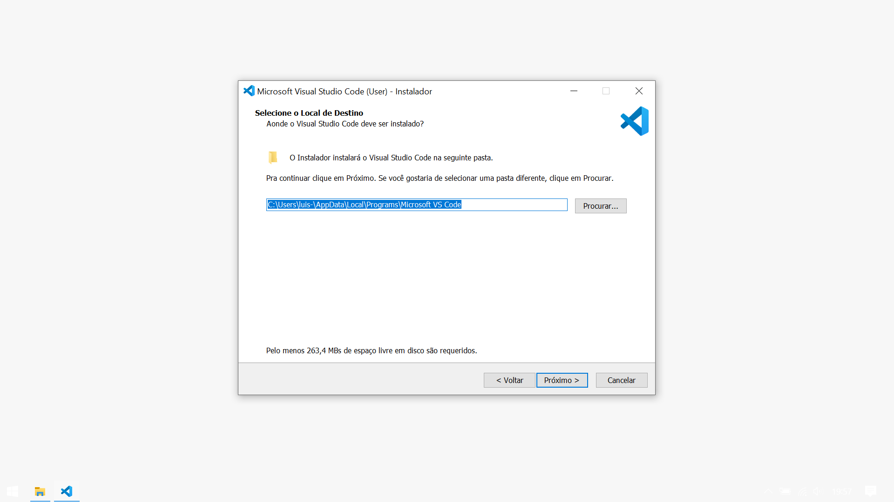

4.Mantenha a opções predefinidas e carregue em **"Próximo"**.

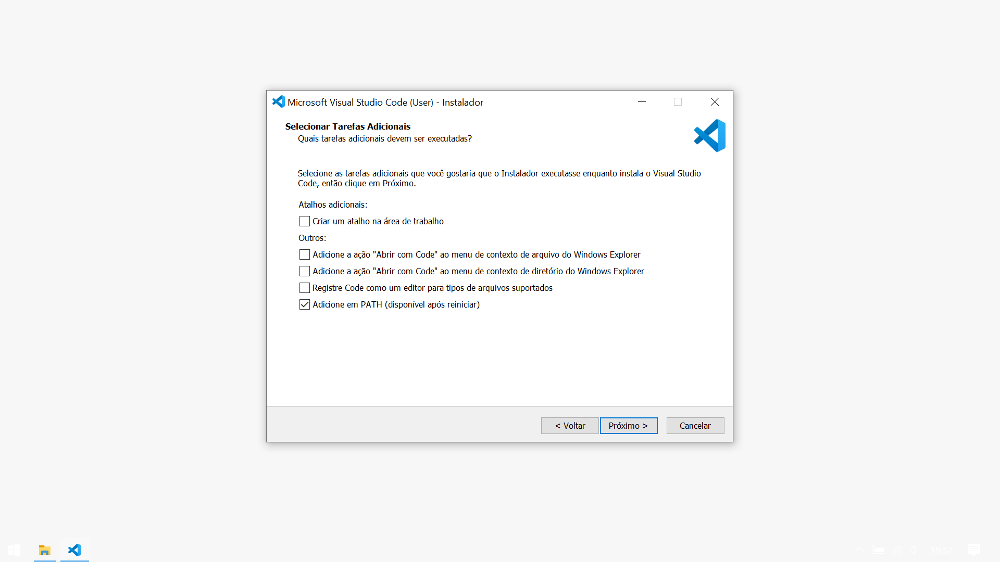

5.Quando aparecer a seguinte janela, a instalação do Visual Studio Code foi concluida.

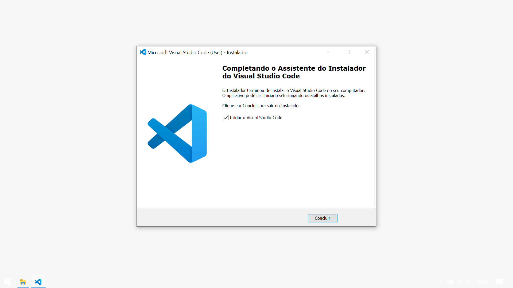
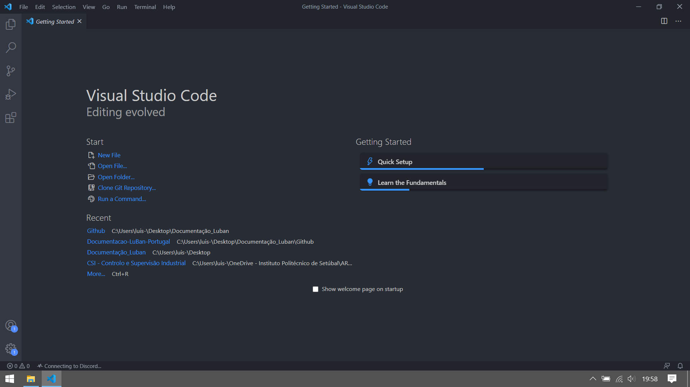

### Git

1.Faça o download do Git em: [Git](https://git-scm.com/download/win) e abra o executável.

2.Assim que aparecer a seguinte janela carregue em **"Next"**.

3.Escolha o local de destino da Instalação, assim que concluído, carregue em **"Next"**.

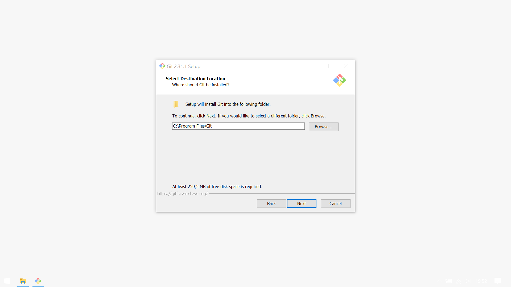

4.Mantenha a opções predefinidas e carregue em **"Next"**.

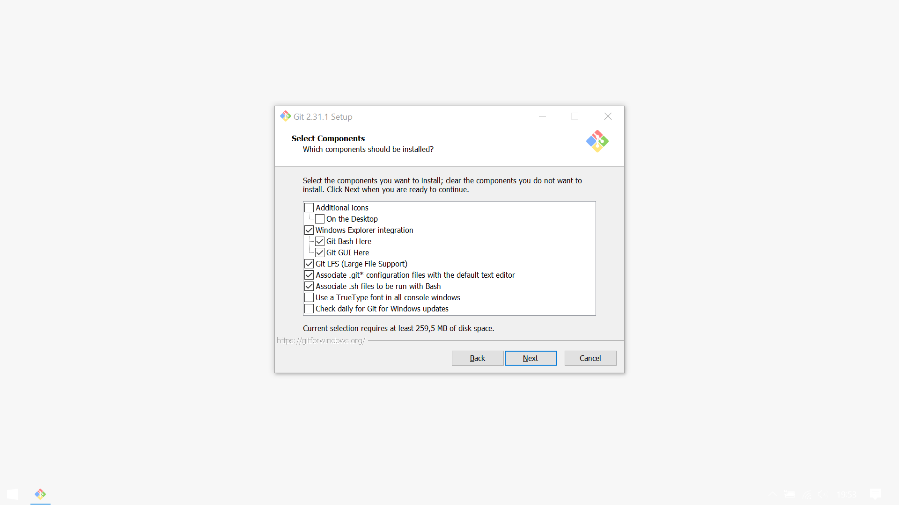

5.Nesta janela, selecione a opção **"Use Visual Studio Code as Git's default editor"**, assim que concluído, carregue em **"Next"**.

6.Mantenha a opções predefinidas e carregue em **"Next"**, nas várias janelas que vão aparecendo. 

7.Quando aparecer a seguinte janela, a instalação do Git foi concluida.

## Primeiros Passos
### Clone do repositório

1.Usando o **Prompt de Comando**, faça a mudança de diretoria (Comando "cd") para a diretoria onde vai ser guardar a documentação.

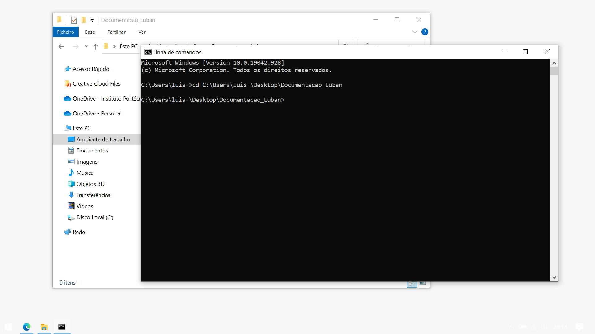

2.Assim que concluído, entre no seu repositório de Github, e carregue no botão verde, **Code**, copie o **HTTPS**. No **Prompt de Comando**, digite o seguinte: *git clone (Link HTTPS)*

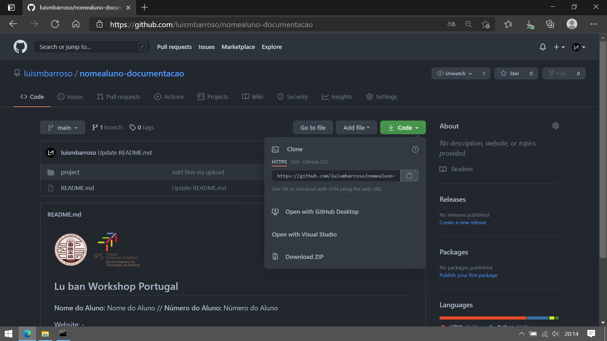

3.Quando o *clone* do repositório for concluído o seu **Prompt de Comando** deve apresentar a mensagens mostradas na imagem abaixo. Desta forma o repositório foi *clonado* com sucesso.

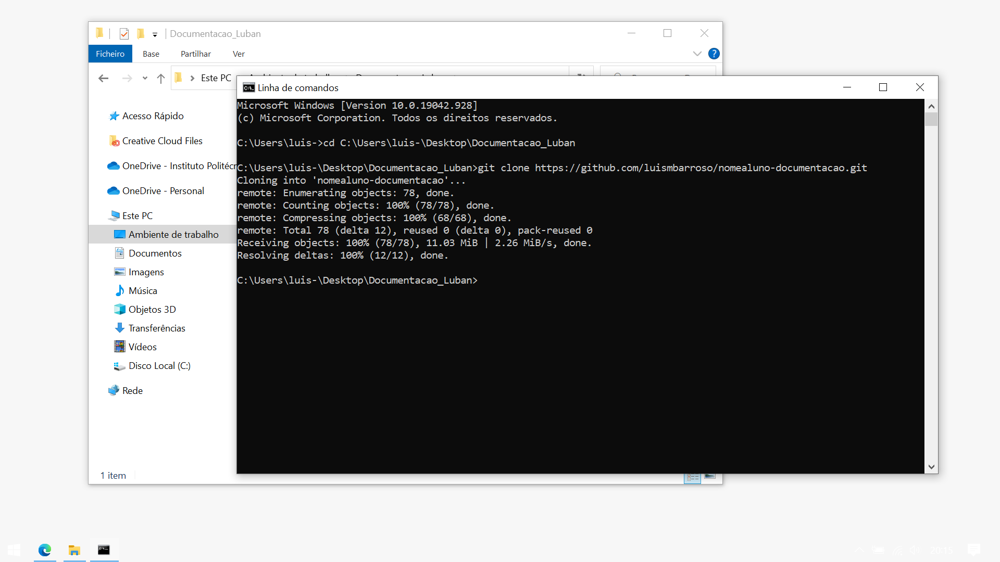

### Primeiros comandos no VSC 

1.Para o seu trabalha se tornar mais fácil, abre o repositório no **Visual Studio Code**, **File > Open Folder** e escolha a diretoria onde se encontra a documentação. 

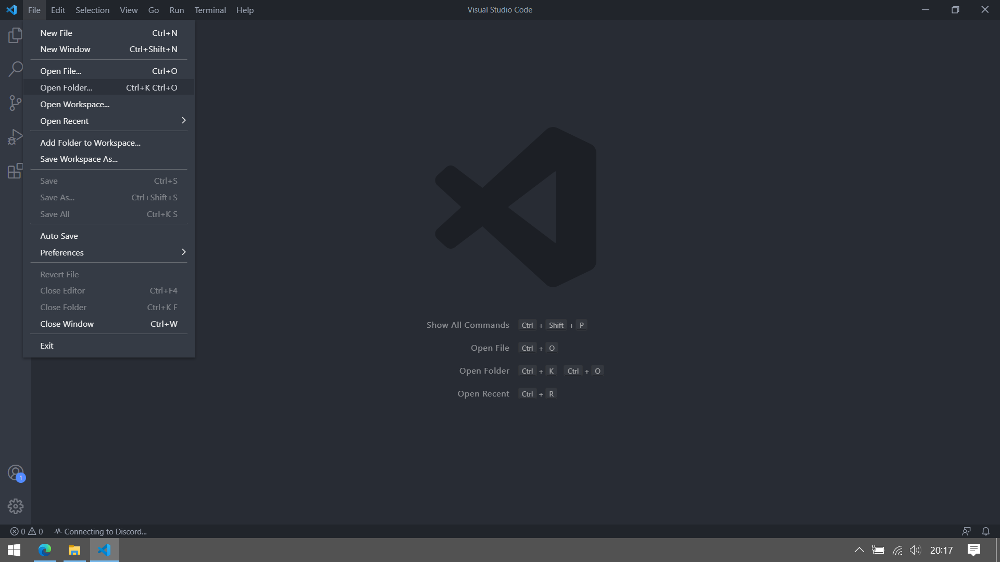
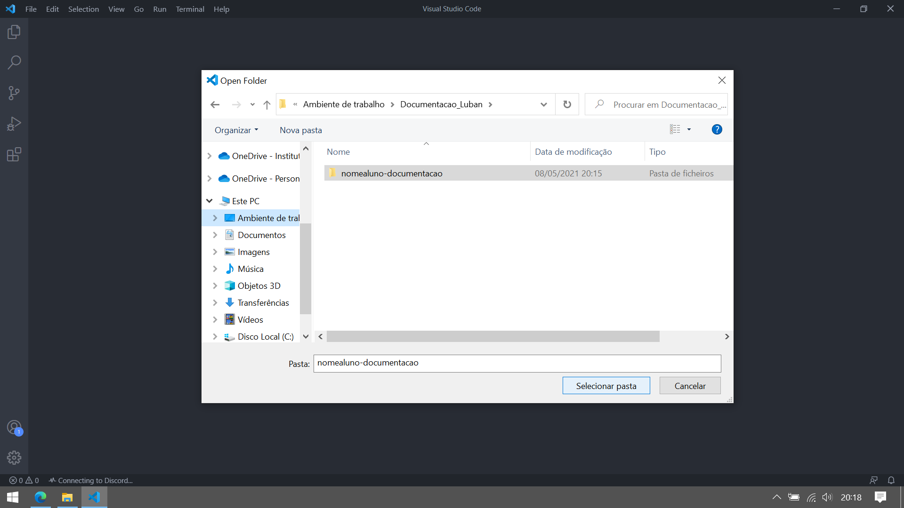

2.Desta forma, todos os ficheiros, presentes na pasta, aparecerão no seu menu lateral. 
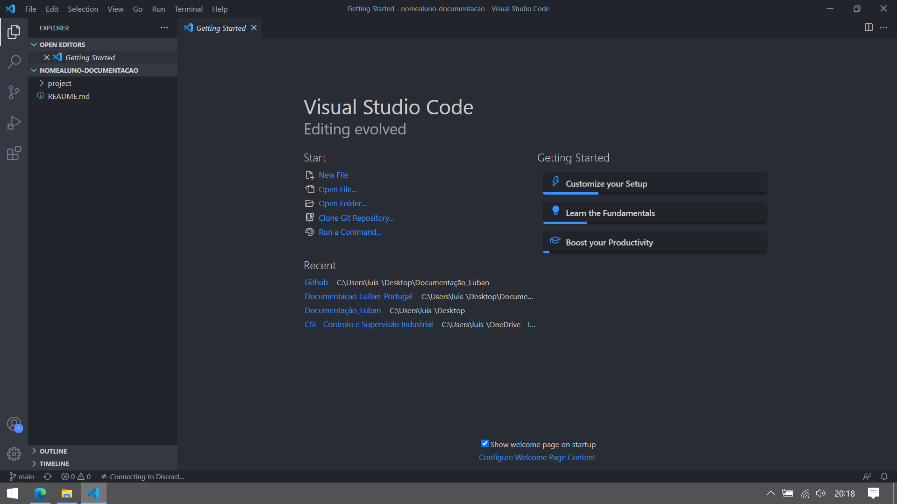

3.Já com repositório incorporado no Visual Studio Code, abra o ficheiro **linexx.md**, e escreva alguma coisa.

4.Carregue no *3º Icon*, no Visual Studio Code, e faça **Stage Changes**, desta forma, esta guardar o ficheiro criado/alterado localmente para que seja enviado para repositório no Github.

5.Ao lado de **Source Control** carregue no *3º Icon (Visto)*, para fazer o **commit** do documento. Escreva uma mensagem, por exemplo, a data/hora que o documento foi alterado.

5.Ainda ao lado de **Source Control** carregue no *4º Icon (3 pontos)*, e faça o **push**. Quando fizer o primeiro **push** esta janela irá aparecer, faça **Sign in with your browser**. Esta ação é necessária, desta forma, o Github, tem a confirmação que você pode fazer alterações no repositório pretendido. 

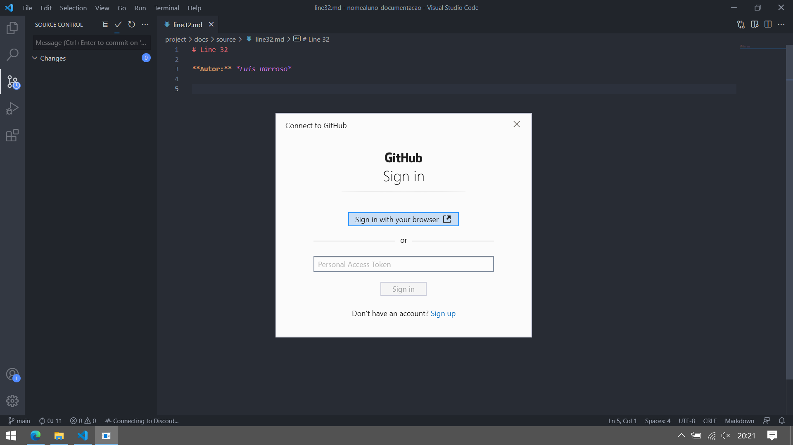

6.Para confirmar que a informação foi enviada e recebida, basta aceder ao repositório no Github.

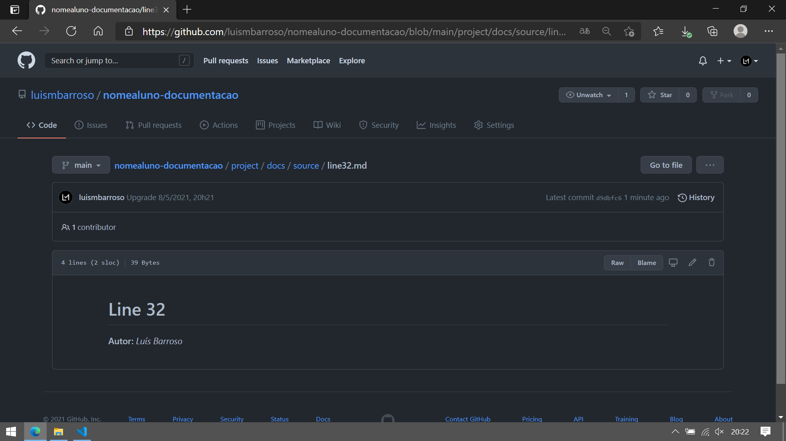

### Erros

No caso de aparecer esta janela, no **Prompt de Comando**, digite o comandos abaixo. O **Mail** e o **Username** deve corresponder aos usados no Github.

    git config --global user.email "Inserir Mail"
    git config --global user.name "Inserir Username"

## Read the docs

O Read the docs, foi a ferramenta escolhida para a renderização da documentação, simples é facil de utilizar.

### Como utilizar

1.Entre no site do Read the Docs: [Read the Docs](https://readthedocs.org/) e faça o **Login**.

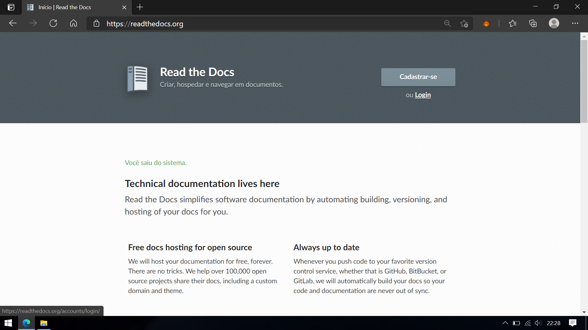

2.Faça o Login usando a conta de Github.

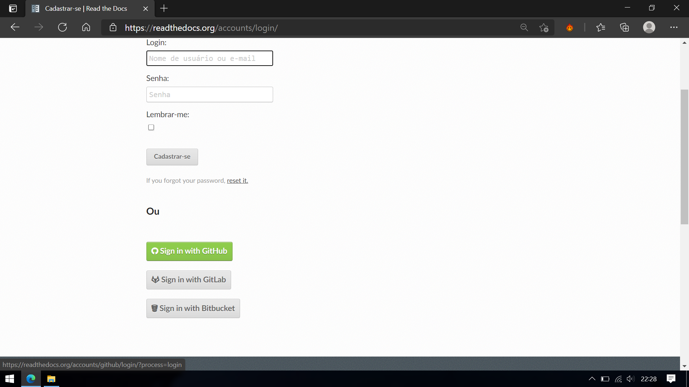

3.Carregue em **importar um projeto**

4.Em **importar repositório**, carrega no **Icon de Atualizar**. Assim que atualizado selecione, o projeto pretendido.

5.Em **detalhes do projeto**, mantenha a opções predefinidas e carregue em **"Próximo"**.

6.Assim que aparecer a janela abaixo o projeto foi importado com sucesso. Carregue em **Build Version** para fazer a renderização o repositório.

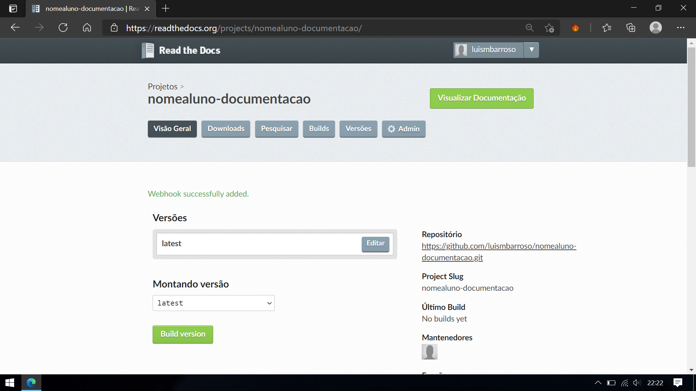

7.Quando a build for concluída, carregue em **Visualizar Documentação. 

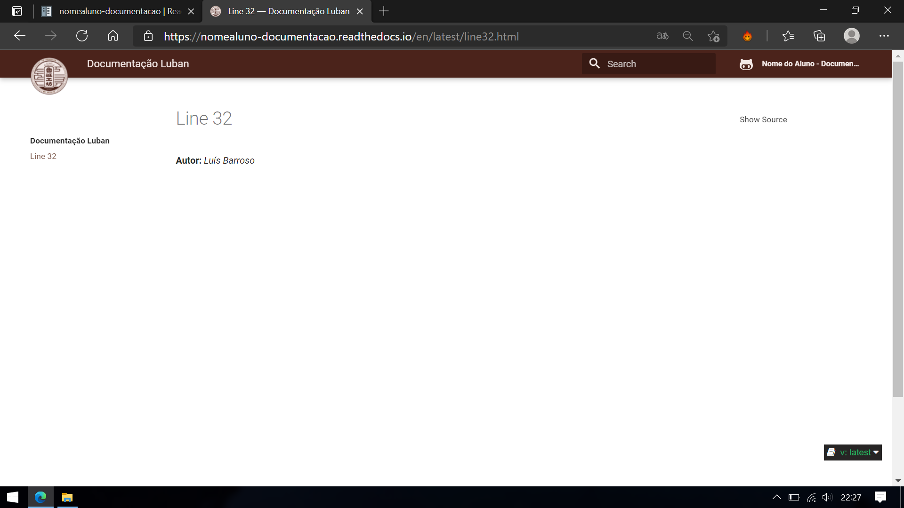

8.E a renderização do repositório foi concluída. 
